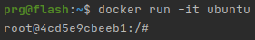
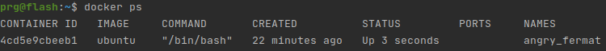
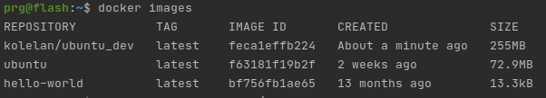

# Примеры работы с docker
## Установка docker
Пакет Docker можно найти в репозитории Ubuntu. Однако, чтобы получить свежую версию программы, лучше обратиться к официальному репозиторию Docker. В этом разделе мы покажем, как загрузить и установить пакет из официального репозитория Docker.

```shell
sudo apt update
# Установите несколько зависимостей:
sudo apt install apt-transport-https ca-certificates curl software-properties-common

# Теперь можно загрузить и установить пакет Docker. Добавьте в систему GPG-ключ репозитория Docker:
curl -fsSL https://download.docker.com/linux/ubuntu/gpg | sudo apt-key add -

# Добавьте репозиторий Docker в APT:
sudo add-apt-repository "deb [arch=amd64] https://download.docker.com/linux/ubuntu focal stable"
sudo apt update

# Посмотрим что нам предлогают
apt-cache policy docker-ce

# Установим
sudo apt install docker-ce

# Программа работает, запросим состояние
sudo systemctl status docker
```
## Настройка команды docker
Если вы попытаетесь запустить команду docker без sudo и вне группы docker, вы получите ошибку:
```shell
# добавьте своего пользователя в группу docker:
sudo usermod -aG docker ${USER}
```
Чтобы активировать это изменение, выйдите из системы и войдите снова
```shell
# То же самое что и перелогиниться 
su - ${USER}

# Пользователь добавлен в группу
id -nG

```
## Использование docker
[Команды и базовое использование докер можно посмотреть здесь](Docker-command-list.MD)

Запуск hello-world
```shell
docker run hello-world
```
Поиск образа на docker Hub
```shell
docker search ubuntu
```
Выбрав необходимый образ, вы можете загрузить его при помощи подкоманды pull
```shell
docker pull ubuntu
```
просмотреть список загруженных образо
```shell
docker images
```

Попробуем запустить контейнер при помощи последнего образа Ubuntu. Комбинация опций –i и –t откроет интерактивную оболочку контейнера
```shell
docker run -it ubuntu
```
Мы можем например получить такой ответ


```shell
root@4cd5e9cbeeb1:/# 
```
Внутри контейнера можно запускать любые команды. Можно обновить индекс пакетов. Добавлять префикс sudo не нужно, работа внутри контейнера выполняется с правами root.
```shell
apt update
# ставим node
apt install nodejs
# смотрим версию
node -v
# выйти из контейнера
exit

```
## Управление контейнерами Docker
просмотреть список активных контейнеро
```shell
docker ps
```

просмотреть список всех контейнеров, включая неактивные **опция -a**
```shell
docker ps -a
```

получить список недавно созданных контейнеров, **опция –l**
```shell
docker ps -l
```

Чтобы запустить неактивный контейнер, введите команду docker start и укажите ID контейнера
```shell
docker start 4cd5e9cbeeb1
```

Остановить запущенный контейнер, введите docker stop + ID этого контейнера. Можно использовать имя, которое контейнерам присваивает Docker. В моём случае angry_fermat

```shell
docker stop angry_fermat
```

Удалить контейнер можно с помощью команды docker rm, указав ID или имя контейнера.
```shell
docker rm angry_fermat
```
Контейнер, который самостоятельно удалится после деактивации, используйте флаг —rm
```shell
docker run -rm ubuntu:latest
```

## Коммиты контейнеров в образы Docker
После запуска образа Docker вы можете создавать, менять и удалять файлы, но если вы остановите контейнер, а потом запустите его, все изменения будут потеряны: все удалённые файлы будут восстановлены, а новые файлы или изменения – исчезнут.

Допустим мы установили nodejs и наш контейнер отличается от исходного, который использован для его создания. Однако его можно использовать в качестве основы для нового образа.

Передайте все изменения в новый образ Docker при помощи команды:
```shell
docker commit -m "What you did to the image" -a "Author Name" container_id repository/new_image_name
```
- Опция –m позволяет создать сообщение о коммите. 
- Опция –a позволяет указать автора коммита. 
- container_id был выписан из командной строки. 
- В качестве репозитория, как правило, указывается имя пользователя your Docker Hub

```shell
# in my case
docker commit -m "Add node and php" -a "kolelan" 163cb720bacd kolelan/ubuntu_dev
```
Проверка


Похожим образом можно собирать образы из файлов типа Dockerfile

## Загрузка образов в репозиторий Docker
Создав новый образ Docker, можно поделиться им на Docker Hub или в другом реестре Docker. Для этого вам нужно иметь аккаунт.

открыть аккаунт при помощи своих учётных данных
```shell
docker login -u docker-registry-username
```
Если имя аккаунта в реестре Docker отличается от имени вашего пользователя, с помощью которого вы создали свой образ, нужно добавить тег с именем из реестра.
```shell
docker tag kolelan/ubuntu-dev docker-registry-username/ubuntu-nodejs
```

Отправить созданный образ в удалённый репозиторий
```shell
docker push docker-registry-username/docker-image-name

```
Загрузив образ в каталог, вы увидите его в аккаунте

Вы можете получить свой образ из удалённого репозитория с помощью команды:
```shell
docker pull docker-registry-username/docker-image-name
```
и запустить на его основе новый контейнер